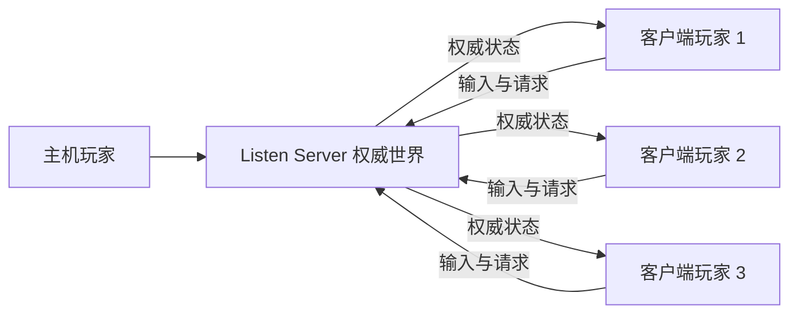
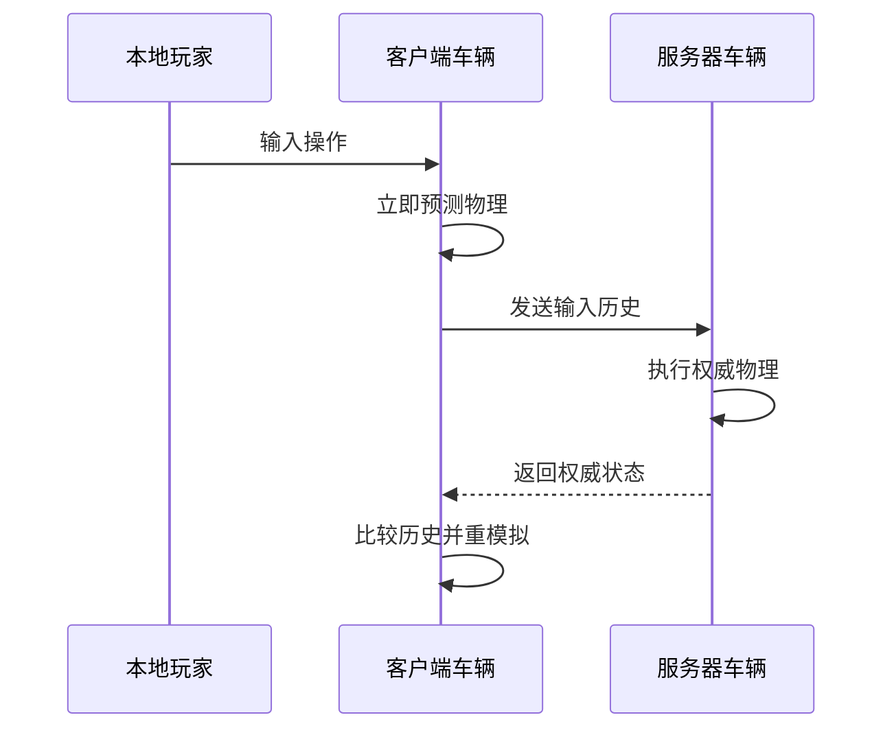
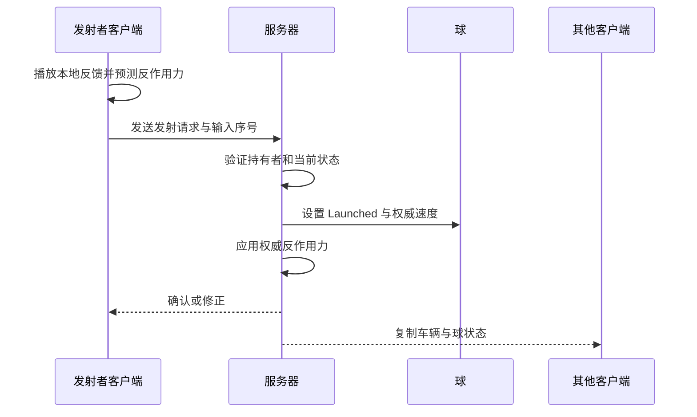
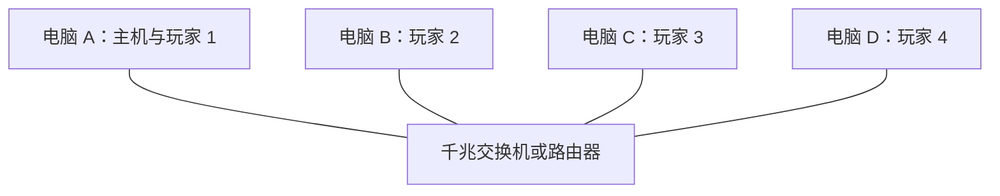

# MVP-B Listen Server 方案说明案

## 1. 方案目的

本方案用于将 MVP-A 的单机车辆与球玩法迁移为可供四台电脑游玩的 Listen Server 联机结构。

MVP-B 首先完成两名玩家的完整联机纵向切片，再以四名玩家进行基础压力测试。本阶段重点验证车辆、球和碰撞玩法在网络环境中的一致性，不制作复杂的在线服务。

## 2. 已确认方案

| 项目 | 决定 |
|---|---|
| 联机形式 | 四人 Listen Server 自由混战 |
| 主机优势 | 接受，不人为增加主机延迟 |
| 本地玩家车辆 | `Resimulation` |
| 远端玩家车辆 | `Predictive Interpolation` |
| 球 | 服务器权威 + `Predictive Interpolation` |
| 发射预测 | 本地表现与反作用力预测，球状态由服务器确认 |
| 中途加入 | 不支持 |
| 断线重连 | 不支持 |
| 主机迁移 | 不支持 |
| 网络目标 | `100 ms` 正常游玩，`150 ms` 仍可游玩 |
| 初期连接 | PIE／局域网 Host 与 Join |
| 最终展示 | 四台电脑通过同一交换机或路由器有线连接 |

## 3. Listen Server 基本结构

Listen Server 中，一台电脑同时运行权威服务器和主机玩家。其他电脑作为客户端加入。



服务器保存唯一可信的游戏状态。客户端负责输入、本地预测、画面插值、摄像机、UI 与非权威表现。

## 4. 三个必须区分的概念

### 4.1 Authority

表示哪台机器有权决定 Actor 的最终状态。本项目中的车辆、球、机关、伤害和比赛结果均以服务器为权威。

### 4.2 Ownership

表示哪个客户端拥有该 Actor，并能够通过它向服务器发送合法请求。每名玩家只拥有自己的 PlayerController、PlayerState 与 Vehicle Pawn 关系。

### 4.3 Local Control

表示该 Pawn 是否由当前机器上的玩家直接操作。输入、摄像机和本地反馈应通过 `IsLocallyControlled` 等条件限制在本地车辆上。

## 5. 主要对象职责

| 对象 | 主要职责 | 网络位置 |
|---|---|---|
| `GameMode` | 玩家生成、比赛规则、胜负判断 | 仅服务器 |
| `GameState` | 比赛阶段、剩余时间、公共比赛状态 | 服务器生成并复制 |
| `PlayerController` | 接收输入、发送请求、管理本地摄像机 | 服务器与对应客户端 |
| `PlayerState` | 玩家身份、ASC、长期属性与状态 | 服务器权威并复制 |
| `Vehicle Pawn` | 车辆物理、控球接口、承受碰撞 | 服务器权威并复制 |
| `Ball Actor` | 球物理、球权、发射者与命中来源 | 服务器权威并复制 |
| `Arena Gimmick` | 机关状态、伤害与位移事件 | 服务器权威 |
| Camera／UI | 本地显示与操作反馈 | 每个客户端独立运行 |

## 6. 车辆输入与同步

现有 `FVehicleInputCmd` 继续作为统一输入数据。Enhanced Input 只负责生成输入命令，车辆移动组件负责消费命令。

```text
Enhanced Input
→ FVehicleInputCmd
→ Network Physics 输入历史
→ ArcadeVehicleMovementComponent
→ Chaos 刚体力与扭矩
```

输入结构至少包含：

```text
Throttle
Steering
Brake／Reverse
Handbrake
Input Sequence
Physics Frame
```

持续输入不得依赖每帧 Reliable RPC。离散操作可以可靠发送，但必须限制调用频率并携带序号，防止重复执行。

## 7. 本地车辆：Resimulation

客户端自己的车辆需要立即响应操作，因此采用完整客户端预测与服务器校正。



客户端保存输入和物理状态历史。收到服务器状态后：

- 误差在允许范围内时继续预测。
- 误差超过阈值时回退到对应物理帧。
- 应用服务器修正后重新模拟到当前帧。
- 视觉模型平滑过渡，避免直接跳变。

主机玩家没有网络往返延迟，但仍使用相同的输入结构与车辆逻辑，避免主机与客户端形成两套驾驶实现。

## 8. 远端车辆：Predictive Interpolation

客户端不预测其他玩家的输入，只接收服务器发来的权威状态，并使用 `Predictive Interpolation` 平滑显示。

远端车辆需要同步：

- 位置与旋转。
- 线速度与角速度。
- 必要的动作状态。
- 当前控球关系。
- 供视觉动画使用的驾驶状态。

远端车辆的车轮、车身倾斜和保险杠动画可以在各客户端根据同步数据本地计算，但不得影响权威碰撞。

## 9. 球：服务器权威 + Predictive Interpolation

球的物理模拟和逻辑状态均由服务器决定。客户端只进行平滑显示和非权威表现。

需要复制的球状态至少包括：

```text
Ball State
Current Holder
Last Launcher
Reacquire Locked Vehicle
State Sequence
必要的状态时间点
```

球权必须来自明确状态，不得通过位置、Attach 或场景层级推断。

### 9.1 自动获取

服务器根据车辆位置、车头方向、距离、遮挡和球状态决定是否成功获取。

客户端可以显示范围提示，但不能自行决定球权。多辆车同时争夺时，以服务器处理结果为准。

### 9.2 发射



本地客户端可以立即播放：

- 按键反馈。
- 车身动作。
- 音效与轻量特效。
- 车辆反作用力预测。

但以下内容必须等待服务器确认：

- 球是否成功发射。
- 球的最终状态和速度。
- 发射者记录。
- 命中对象与伤害结果。

服务器拒绝发射时，客户端必须取消未确认表现并通过重模拟修正车辆。发射事件必须携带唯一序号，防止反作用力被重复应用。

## 10. 碰撞与命中边界

客户端上的碰撞只能用于预测和表现，最终玩法结果只在服务器生成。

```text
服务器物理碰撞
→ 生成 FVehicleHitContext
→ Combat Resolver 判断伤害与位移资格
→ 物理层应用击飞／位移
→ GAS 层结算伤害／状态
```

普通车辆碰撞仍然可以造成位移、姿态变化和脱球，但不直接获得伤害资格。

客户端不得上报：

- “我命中了谁”。
- “造成了多少伤害”。
- “我成功获得了球”。
- “目标应当被击飞到哪里”。

## 11. GAS 边界

Listen Server 方案只负责保证权威事件正确产生和传递。GAS 作为独立结算层处理：

- HP 与 Attribute。
- Gameplay Effect。
- Buff／Debuff 与持续状态。
- 技能权限、冷却与消耗。
- Gameplay Tag。
- Gameplay Cue。

GAS 不负责车辆位置预测、球轨迹预测、Chaos 碰撞或物理重模拟。

## 12. 摄像机与 UI

每名玩家的摄像机完全在本地计算，不复制摄像机 Transform。

本地系统可以读取已复制的车辆、球和机关位置，用于：

- 跟随本地车辆。
- 动态调整镜头距离。
- 屏幕震动。
- 屏幕边缘提示。
- HUD 与技能反馈。

服务器不决定任何玩家的镜头距离与画面效果。

## 13. 连接流程

### 13.1 开发阶段

- 使用 PIE Listen Server + Client。
- 使用独立窗口确认每名玩家的输入和摄像机。
- 支持通过主机局域网 IP 直接加入。

### 13.2 MVP-B 最小界面

- `Host`：以 Listen Server 方式打开测试地图。
- `Join`：输入主机局域网 IP 后加入。
- 不制作账号、好友、房间列表和邀请系统。
- 自动发现 LAN 房间不属于最低完成要求。

## 14. 最终有线展示结构

四台电脑连接同一台千兆交换机或路由器，其中一台作为 Listen Server。



推荐由路由器提供 DHCP。仅使用普通交换机时，为四台电脑设置同一子网内的静态 IP。展示前必须确认 Windows 防火墙允许游戏程序和项目使用的 UDP 端口。

## 15. 玩家加入与退出规则

- 每台电脑只支持一名本地玩家。
- 玩家只能在比赛开始前加入。
- 比赛进行中拒绝新的连接请求。
- 客户端退出后，由服务器移除对应车辆。
- 客户端断线后不能恢复原有状态。
- 主机退出时本局立即结束。
- 不进行主机迁移。

## 16. 实现顺序

### 16.1 连接与生成

- 两名玩家建立 Listen Server 连接。
- GameMode 在服务器生成车辆。
- PlayerController 正确 Possess 对应车辆。
- 每名玩家只能操作自己的车辆。
- 摄像机只跟随本地车辆。

### 16.2 服务器权威基线

- 客户端发送输入，服务器执行车辆和球的最终模拟。
- 控球、发射、脱球、命中和反作用力由服务器确认。
- 先使用此版本验证规则正确性，不将其作为最终驾驶手感标准。

### 16.3 Network Physics

- 本地车辆接入 `Resimulation`。
- 远端车辆接入 `Predictive Interpolation`。
- 球接入服务器权威的 `Predictive Interpolation`。
- 处理预测错误、重模拟、碰撞修正和表现平滑。

### 16.4 GAS 接口

- 服务器命中事件能够稳定进入 Combat Resolver。
- Combat Resolver 将结算结果交给 GAS。
- 验证一次伤害、一个持续状态和一个主动技能。

### 16.5 四人基础测试

- 四辆车与一颗球同时运行。
- 验证带宽、碰撞、球权和修正稳定性。
- 不要求在本阶段完成完整五分钟比赛流程。

## 17. 网络测试条件

必须在以下环境中测试：

| RTT | 目标 |
|---:|---|
| `0～20 ms` | 局域网及最终有线展示基准 |
| `50 ms` | 常规网络测试 |
| `100 ms` | 应保持正常游玩 |
| `150 ms` | 允许可见修正，但仍应能够游玩 |

丢包测试：

- `0%`：正常基准。
- `1%`：不得产生永久状态错误。
- `3%`：不得重复发射、重复伤害或永久丢失球权。

重点场景：

- 玩家连接、生成和 Possess。
- 持续油门、转向、刹车和漂移。
- 车辆撞墙、侧撞和连续碰撞。
- 两辆车同时争夺一颗球。
- 客户端发射、反作用力和服务器修正。
- 球反弹后命中车辆。
- 发射者免疫自己的球伤害。
- 客户端退出和主机退出。

## 18. 完成标准

MVP-B Listen Server 完成时，应满足：

- 主机与客户端均能稳定加入并控制各自车辆。
- 客户端无法操作其他玩家车辆或决定权威结果。
- 本地车辆操作及时，服务器修正不会长期破坏驾驶体验。
- 所有客户端最终看到一致的球状态、持有者与发射者。
- 发射和命中不会因网络重发而重复执行。
- `100 ms` RTT 下可以正常驾驶、争球和发射。
- `150 ms` RTT 下允许出现可见修正，但不得形成永久不同步。
- `1%～3%` 丢包下不会产生永久球权错误或重复伤害。
- 四台有线连接电脑能够完成基础四人压力测试。

## 19. 本阶段不包含

- Dedicated Server。
- 在线账号与平台服务。
- Steam／EOS 邀请与匹配。
- 自动 LAN 房间列表。
- 比赛中途加入。
- 断线重连。
- 主机迁移。
- 反作弊系统。
- 完整比赛、观战和结算流程。

## 20. 参考资料

- [Unreal Engine 5.8 Networking Overview](https://dev.epicgames.com/documentation/en-us/unreal-engine/networking-overview-for-unreal-engine)
- [Unreal Engine 5.8 Networked Physics Overview](https://dev.epicgames.com/documentation/en-us/unreal-engine/networked-physics-overview)
